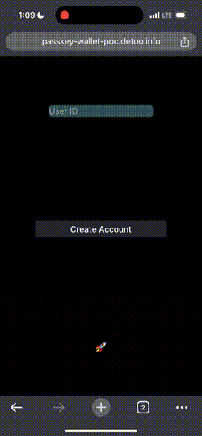

# Passkey Wallet Proof-of-Concept

Live demo @ [https://passkey-wallet-poc.detoo.info/](https://passkey-wallet-poc.detoo.info/)
> Note: you might need a newer version of iOS or Android in order to use the Passkey feature.

The project demonstrates the ability to own an Ethereum VM account, send and receive arbitrary tokens
using your mobile phone without downloading any crypto app, nor depending on third-party custodian services,
nor even holding any crypto as the prerequisites to pay for transaction fees.

More specifically, the user can use his Passkey device (ex. fingerprint reader, Face ID, etc.) to 
sign and register an account, receive 100 test tokens, and send it to other accounts (or to any arbitrary address). 
Since the transaction fee is sponsored by a third party, the user does not need to buy or hold any other crypto asset, 
therefore on-ramp is much simpler this way. All the user needs is a mobile phone with Passkey-support to get started.

The project also runs as a PWA and demonstrates native-like app experiences, where the user can subscribe to and
get notified whenever his account has received tokens. Making a true wallet experience.

## PWA Installation

You can use the app as-is in a web browser; however, to get the native app experience such as 
token receipt notification, you can install it as a PWA 
(the tutorial below uses iOS as the example, the steps on Android are similar):

1. Open the live demo in Safari (unfortunately PWA is not supported yet on other iOS browsers)
2. Click Share -> Add to Home Screen
3. A new icon will appear on your iOS Home Screen and you can open it like a native app
4. Type the User ID you want to receive notifications
5. Click Enable Notifications, accept it if iOS asks for your permission
6. Now you will be notified whenever the user receives token, even when the app is not running

## Architectures

- [ERC-4337](https://www.erc4337.io/) (Account Abstraction) for Smart Contract wallets
- [P256 Verifier](https://daimo.xyz/blog/p256verifier) for verifying Passkey's secp256r1 signatures
- [Pimlico](https://www.pimlico.io/) for off-chain infra (bundler and paymaster)
- [PWA](https://learn.microsoft.com/en-us/microsoft-edge/progressive-web-apps-chromium/) for native app UX

## File Structures

- [`contracts/`](contracts/): Solidity contracts for Passkey Account, Factory and test token
- [`frontend/`](frontend/): Web UI for interacting with the wallet 

## References

- Inspired by [ZK Face ID](https://hackmd.io/@knownothing/zk-face-id) and their awesome [demo](https://www.noseedphrases.xyz/) 🔥